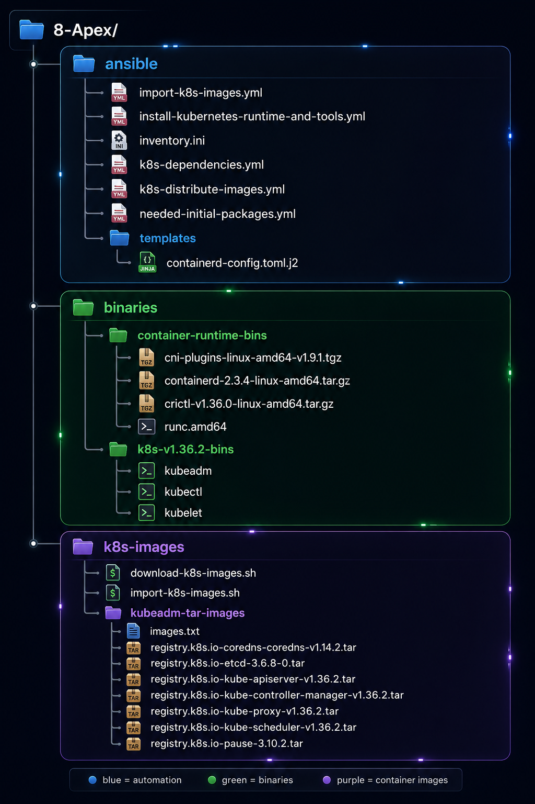

## prerequisites on each node:
* 2 GB or more of RAM
* 2 CPUs or more
* Unique hostname, MAC address, and product_uuid for every node
 
---

## verify MAC address and product_uuid

k8s use these values to identify each node in cluster.

1. check MAC address:
```
$ ip link
or
$ ip a
or
$ ifconfig -a
```
2. check product_uuid:
```
$ sudo cat /sys/class/dmi/id/product_uuid 
```

each value has to be unique.

---

## turn off swap on each node

remove swap partition and add its storage to lv root:
```
$ sudo swapoff -a                     # disable swap
$ sudo swapoff /dev/rlm_vbox/swap     # disable swap
$ free -h         # verify
$ swapon --show   # verify
$ nano /etc/fstab # remove swap line
$ sudo systemctl daemon-reload
$ sudo findmnt --verify
$ sudo lvremove /dev/rlm_vbox/swap
$ sudo lvextend -l +100%FREE /dev/rlm_vbox/root
$ sudo xfs_growfs /
$ df -h
$ lsblk
$ vgs
```

remove swap refrences from grub:
```
$ nano /etc/default/grub 
```

replace this line:
```
GRUB_CMDLINE_LINUX="crashkernel=2G-64G:256M,64G-:512M resume=UUID=71a46390-5a1f-45a7-b15d-8815feece9e3 rd.lvm.lv=rlm_vbox/root rd.lvm.lv=rlm_vbox/swap"
```

with this line:
```
GRUB_CMDLINE_LINUX="crashkernel=2G-64G:256M,64G-:512M rd.lvm.lv=rlm_vbox/root"
```

recreate grub and initramfs:
``` 
$ sudo grub2-mkconfig -o /boot/grub2/grub.cfg --update-bls-cmdline     # rebuild grub config
$ sudo dracut --regenerate-all --force     # rebuild the initramfs
```

check grub parameters for swap refrences. you shouldnt see any swap refrence.
```
$ sudo grubby --info=ALL | grep -E 'kernel=|args='
```

if you still have those swap refrences remove those parameters from all kernels with with grubby (replace the UUID with your own swap UUID):
```
$ sudo grubby --update-kernel=ALL \
  --remove-args="resume=UUID=71a46390-5a1f-45a7-b15d-8815feece9e3 rd.lvm.lv=rlm_vbox/swap"
```
the check it again with the `grubby --info=ALL` command. they have to be gone by now.

---

## configure ansible to run playbooks

we manage and run ansible playbooks from `CP-1`.
```
$ mkdir ansible-plays
```

create an `inventory.ini` file with the content from here [inventory.ini](https://github.com/Parsa-19/8-Apex/blob/sherkat/ansible/inventory.ini):

first install required ansible collections:
```
$ ansible-galaxy collection install community.general
$ ansible-galaxy collection install ansible.posix
``` 

create another file named `k8s-dependencies.yml` to install and configure all dependencies from this file ([k8s-dependencies.yml](https://github.com/Parsa-19/8-Apex/blob/sherkat/ansible/k8s-dependencies.yml)).

run the playbook:
```
$ ansible-playbook -i inventory.ini k8s-dependencies.yml
```

verify everything:
```
$ lsmod | grep br_netfilter
$ lsmod | grep overlay

$ sysctl net.bridge.bridge-nf-call-iptables
$ sysctl net.ipv4.ip_forward

$ getenforce

$ firewall-cmd --list-ports
```

this playbook will:
1. load and persist these kernel modules `br_netfilter` & `overlay`.
2. apply these kernel parameters:
    * `net.bridge.bridge-nf-call-iptables = 1`
    * `net.bridge.bridge-nf-call-ip6tables = 1`
    * `net.ipv4.ip_forward = 1`
3. disables SELinux (until its compatible with k8s cluster)
4. enable these firewalld ports in `control-plane` nodes:
    - 6443/tcp
    - 2379-2380/tcp
    - 10250/tcp
    - 10251/tcp
    - 10252/tcp
5. enable these firewalld ports in `worker` nodes:
    - 10250/tcp
    - 30000-32767/tcp
6. enable this port in `load balancer` nodes:
    - 6443/tcp

---

## install initial packages for the life
specifically for my rocky v10.2 minimal I have litterally nothing in my OS so wrote a mini playbook to install packages (like tar, unzip, vim and etc...) on all nodes:

[needed-initial-packages.yml](https://github.com/Parsa-19/8-Apex/blob/sherkat/ansible/needed-initial-packages.yml)

run to insatll:
```
$ ansible-playbook -i inventory.ini needed-initial-packages.yml
```

---

## install kubelet, kubeadm and containerd on CPs and workers

for that I downloaded each of the binary files and used an ansible playbook to install and configure them on dedicated nodes offline.

use this playbook [install-kubernetes-runtime-and-tools.yml](https://github.com/Parsa-19/8-Apex/blob/sherkat/ansible/install-kubernetes-runtime-and-tools.yml) and run it:
```
$ ansible-playbook -i inventory.ini install-kubernetes-runtime-and-tools.yml
```

that gives you a clean two-play playbook structure like this:
```
Play 1:
  cp-1
  cp-2
  cp-3
  node-1
  node-2

  - containerd
  - runc
  - CNI
  - crictl
  - kubelet
  - kubeadm


Play 2:
  cp-1 only

  - kubectl
```

to understand the playbook first consider the working dir which is used to install the components like this:

I am going to create this file-structure-diagram hierarchy here and also complete it in later steps.



now you can understand how the playbook works:
#### first playbook named `Install Kubernetes dependencies` on all k8s nodes:
1. first it configures variables about **versions, local downloaded bin file names, installation paths and temp dir** to be used inside the playbook itself.
2. creates the basic directories:
    * the temp folder that holds data while installing `/tmp/k8s-install`.
    * containerd configuration dir `/etc/containerd`.
    * installation dir for CNI plugins `/opt/cni/bin` (needed by containerd).
    * CNI configuration directory `/etc/cni/net.d`.
3. copies the **containerd** bin file to dedicated node with `0644` permissions and:
    * install it by unarchiving it to `/usr/local`
4. copies the **runc** bin file to dedicated node with `0755` permissions and:
    * install it by copying it to `/usr/local/sbin/runc` and ensures the `0755` perms too.
5. copies the **CNI plugins** bin file to dedicated node with `0644` permissions and:
    * install it by unarchiving it to `/opt/cni/bin`.
6. copies the **crictl** bin file to dedicated node with `0644` permissions and:
    * install it by unarchiving it to `/usr/local/bin/crictl` and ensures the `0755` perms too.
7. installs the **containerd systemd service** by:
    * creating this dir `/usr/local/lib/systemd/system` with perm `0755`.
    * and download the service file from `https://raw.githubusercontent.com/containerd/containerd/main/containerd.service`.
    * and put the content in `/usr/local/lib/systemd/system/containerd.service` with perm `0644`.
8. use prepared **containerd-config.toml** file as ansible template.
    * copies it to `/etc/containerd/config.toml` with perms `0644`.
    * this file is already configured with systemdCgroups (dedicated for containerd 2.x configurations):
        ```
        [plugins.'io.containerd.cri.v1.runtime'.containerd.runtimes.runc.options]
        SystemdCgroup = true
        ```
    * then restarts the containerd
9. Ensure **CRI is enabled**
10. **configures the crictl** conf file `/etc/crictl.yaml` with perms `0644` with content:
    ```
    runtime-endpoint: unix:///run/containerd/containerd.sock
    image-endpoint: unix:///run/containerd/containerd.sock
    timeout: 10
    debug: false    
    ```
11. after that all **reloads the systemd**.
12. **enables and starts containerd service**.
13. to install **kubelet** ansible copies the bin file to `/usr/local/bin/kubelet` with perms `0755`.
14. to install **kubeadm** ansible copies the bin file to `/usr/local/bin/kubeadm` with perms `0755`.
15. installs **kubelet service** by:
    * creating service file in `/etc/systemd/system/kubelet.service` with perms `0644` with the contents of [kubelet.service](https://github.com/Parsa-19/8-Apex/blob/sherkat/kubernetes/kubelet.service).
16. **reloads systemd**
17. **enables kubelet**
18. then there is bunch of tasks to get the version of each component and registers them in variables
19. registers the **status of containerd**
20. **displays all the versions** 
21. at the end of first playbook there is restart contianerd handler that's been used in step 8.

#### second playbook named `Install kubectl on cp-1` on cp-1:
22. copies the **kubectl** bin file to `/usr/local/bin/kubectl` with perms `0755`.
23. get **kubectl version** and registers the variable.
24. **displays kubectl version**.

#### download refrences:
* containerd v2.3.4 --> `https://github.com/containerd/containerd/releases/download/v2.3.4/containerd-2.3.4-linux-amd64.tar.gz`
* containerd.service file --> `https://raw.githubusercontent.com/containerd/containerd/main/containerd.service`
* runc v1.5.1 --> `https://github.com/opencontainers/runc/releases/download/v1.5.1/runc.amd64`
* CNI plugin v1.9.1 --> `https://github.com/containernetworking/plugins/releases/download/v1.9.1/cni-plugins-linux-amd64-v1.9.1.tgz`
* crictl v1.36.0 --> `https://github.com/kubernetes-sigs/cri-tools/releases/download/v1.36.0/crictl-v1.36.0-linux-amd64.tar.gz`
* kubelet --> `https://dl.k8s.io/v1.36.2/bin/linux/amd64/kubelet`
* kubeadm --> `https://dl.k8s.io/v1.36.2/bin/linux/amd64/kubeadm`
* kubectl --> `https://dl.k8s.io/v1.36.2/bin/linux/amd64/kubectl`

---

## download k8s necessary component images as tar files and import them

1. I will download the initial k8s needed images by a script which first use ctr to pull and then export images to a tar file. I will run this on cp-1 node.<br>
you can check out these initial images by:
    ```
    $ kubeadm config images list --kubernetes-version=v1.36.2
    ```

2. then use ansible to copy image tar files to all nodes (copy all images incase I want to turn a worker to control plane later; plus these images are light weight).

3. create a script file to import all image tar files on each node.

4. instead of running import script manually on each node I use another anisble playbook to run the import script and import the image tar files to containerd on each node.

> [!Caution]
> these images must be imported to k8s.io namespace which will be done in later steps sequence.

> [!TIP]
> `ctr` tool is available through `containerd-2.3.4-linux-amd64.tar.gz` package bundle I have installed.

> [!Important]
> as I explained in previous part the diagram file structure [file-structure-diagram.png](https://github.com/Parsa-19/8-Apex/blob/sherkat/diagrams/file-structure-diagram.png) is now what I am going to complete the it here. so take a look at the diagram again and create files like that in your working directory.
> and also in my case the root of my project is in `/root/8-Apex`.

#### first is the script that downloads k8s images
download this script file [download-k8s-images.sh](https://github.com/Parsa-19/8-Apex/blob/sherkat/scripts/download-k8s-images.sh) into `/root/8-Apex/k8s-images/download-k8s-images.sh`.

give it the execute perm and run it:
```
$ chmod +x download-k8s-images.sh
$ ./download-k8s-images.sh
```
this pulles images to k8s.io namespace in cp-1 (where you had ran this script on) and exports the image files to tar files to import them in rest of control planes.<br>
this also write image names that have been pulled and downloaded to a new file in the same dir named `images.txt`.
 
#### writing an ansible-playbook to distribute image files
download ansible-playbook file [k8s-distribute-images.yml](https://github.com/Parsa-19/8-Apex/blob/sherkat/ansible/k8s-distribute-images.yml) into `/root/8-Apex/ansible/k8s-distribute-images.yml`.

run the playbook from cp-1:
```
$ ansible-playbook -i inventory.ini k8s-distribute-images.yml
```

#### create another script file to import tar images
download the script file [import-k8s-images.sh](https://github.com/Parsa-19/8-Apex/blob/sherkat/scripts/import-k8s-images.sh) into `/root/8-Apex/k8s-images/import-k8s-images.sh`.

give it exec permissions:
```
$ chmod +x import-k8s-images.sh
```

*it will be used in another ansible playbook to be copied and run on all cluster nodes*.

#### create ansible playbook to run import script on all cluster nodes
download the file [import-k8s-images.yml](https://github.com/Parsa-19/8-Apex/blob/sherkat/ansible/import-k8s-images.yml) into `/root/8-Apex/ansible/import-k8s-images.yml`.

run the playbook:
```
$ ansible-playbook -i inventory.ini import-k8s-images.yml
```

after all you can verify the image importing on all nodes by listing them:
```
$ crictl images
```

---

## init the cluster

This section describes how to initialize the Kubernetes cluster, configure the HA control plane with kube-vip, install Cilium, and join the remaining control-plane and worker nodes.

as intalled and described in priviouse the cluster uses:

- **Container runtime:** containerd
- **CNI:** Cilium
- **HA control-plane VIP:** `192.168.55.100`
- **Node network:** `192.168.55.0/24`
- **Pod network:** `10.244.0.0/16`
- **Service network:** `10.96.0.0/12`
- **Node interface:** `enp0s8`
- **Node IP:** `192.168.55.x`
- **NAT interface:** `enp0s3` (`10.0.2.x`), used for external/internet access when available

### 1. Prepare every node

Before initializing or joining the cluster, ensure that `kubelet` and `containerd` are installed, enabled, and working correctly on every node.

Check them with:

```bash
$ systemctl status containerd
$ systemctl status kubelet
```

check out the logs for errors:

```
$ journalctl -xeu kubelet
$ journalctl -xeu containerd
```

if no errors then go to step 2.

---

### 2. Prepare Kubernetes images for the offline environment

as you have done this in **download k8s necessary** part(you can skip step 2 if you have already done it), for an offline installation, every node must already have the container images required for the Kubernetes components that will run on that node.

you can see required Kubernetes images before initializing or joining nodes:
```bash
kubeadm config images list --kubernetes-version v1.36.2
```

Pull/export the required images on a node with internet access and distribute them to the offline nodes as described in the project's image-management procedures.

Import images into containerd's Kubernetes namespace:

```bash
ctr -n k8s.io images import <image-tar-file>
```

Verify the images:

```bash
ctr -n k8s.io images ls
```

The important point is that images must be available to **containerd in the `k8s.io` namespace**, because this is the namespace used by Kubernetes through the containerd CRI.

---

### 3. Prepare Cilium images

Cilium is the cluster CNI, so its images must be available on all the cluster nodes before Cilium is installed in an offline environment.

The required Cilium images for this project are:

```text
quay.io/cilium/cilium:v1.20.1
quay.io/cilium/cilium-envoy:v1.37.5-1786810558-766ccfb37260a43e9d228837aa84ce3faf9f64e7
quay.io/cilium/operator-generic:v1.20.1
```

The exact image digests used by the project should be preserved when exporting and importing the images.

Verify the images on a node with:

```bash
ctr -n k8s.io images ls | grep -i cilium
```

For the offline setup, export the Cilium images on CP-1, distribute the resulting archive to the required nodes, and import it into the `k8s.io` containerd namespace:

```bash
ctr -n k8s.io images export cilium-images.tar <image1> <image2> <image3>
```

On the destination node:

```bash
ctr -n k8s.io images import cilium-images.tar
```

Verify:

```bash
ctr -n k8s.io images ls | grep -i cilium
```

All nodes on which Cilium Pods will run must have the required Cilium images available before the Cilium installation is started.

---

### 4. Prepare kube-vip

kube-vip provides the highly available control-plane endpoint:

```text
192.168.55.100:6443
```

The VIP is used as the `controlPlaneEndpoint` in kubeadm:

```yaml
controlPlaneEndpoint: "192.168.55.100:6443"
```

The VIP is configured on the `enp0s8` interface.

Create the kube-vip static Pod manifest at:

```text
/etc/kubernetes/manifests/kube-vip.yaml
```

Create the directory if necessary:

```bash
mkdir -p /etc/kubernetes/manifests
```

Get the latest kube-vip version:

```bash
echo "$(curl -sL https://api.github.com/repos/kube-vip/kube-vip/releases | jq -r ".[0].name")"
```

For the version used in this project:

```bash
export VIP=192.168.55.100
export INTERFACE=enp0s8
export KVVERSION=v1.2.3
```

The kube-vip image can be pulled and the manifest generated with:

```bash
alias kube-vip="ctr -n k8s.io image pull ghcr.io/kube-vip/kube-vip:$KVVERSION; ctr -n k8s.io run --rm --net-host ghcr.io/kube-vip/kube-vip:$KVVERSION vip /kube-vip"

kube-vip manifest pod \
    --interface $INTERFACE \
    --address $VIP \
    --controlplane \
    --services \
    --arp \
    --leaderElection | tee /etc/kubernetes/manifests/kube-vip.yaml
```

The generated manifest must use the kubeconfig appropriate for the kubeadm version used by the project. In this project, the kube-vip manifest uses `super-admin.conf` instead of `admin.conf`.

Use the project's prepared manifest:

[kubernetes/kube-vip.yaml](https://github.com/Parsa-19/8-Apex/blob/sherkat/kubernetes/kube-vip.yaml)

For an offline installation, the kube-vip image must be available locally on every control-plane node before that node starts using the kube-vip manifest.

On CP-2 and CP-3:

1. Export the kube-vip image on a node with access to the image.
2. Copy the image archive to the control-plane node.
3. Import the image into containerd.
4. Copy `kube-vip.yaml` to `/etc/kubernetes/manifests/`.
5. Verify that the kube-vip Pod starts.

Do **not** place the kube-vip manifest on worker nodes. kube-vip is used here for the control-plane HA endpoint.

---

### 5. Initialize CP-1

Prepare the project's kubeadm configuration:

[kubernetes/kubeadm-init.yml](https://github.com/Parsa-19/8-Apex/blob/sherkat/kubernetes/kubeadm-init.yml)

Because each node has two network interfaces, Kubernetes must use the `192.168.55.x` address as the node IP rather than the NAT address on `enp0s3`.

For example, I set the node-ip on CP-1 `192.168.55.118` in kubeadm-init.yml file in cp-1:

```yaml
nodeRegistration:
  kubeletExtraArgs:
    - name: "node-ip"
      value: "192.168.55.118"
```

The corresponding `node-ip` must be changed for every node in its init or join yml file.

Initialize CP-1:

```bash
kubeadm init \
  --config kubeadm-init.yml \
  --upload-certs \
  --v=5
```

`--upload-certs` uploads the certificates required to add additional control-plane nodes.

After initialization, configure kubectl for the administrative user:

```bash
mkdir -p $HOME/.kube
cp -i /etc/kubernetes/admin.conf $HOME/.kube/config
chown "$(id -u)":"$(id -g)" $HOME/.kube/config
```

Verify the API server:

```bash
kubectl cluster-info
```

Verify CP-1:

```bash
kubectl get nodes -o wide
```

At this stage CP-1 should be using:

```text
192.168.55.118
```

as its Kubernetes InternalIP.

verity the vip is created and binded to your enp0s8 interface:

```
ip a
```

you should see the vip appears under enp0s8.

also you can check to see if the static pod is created for vip or not:

```
crictl ps -a | grep -i kube-vip
```

---

### 6. Install Helm and Cilium

Install Helm on the control-plane node used to manage the cluster.

Verify Helm:

```bash
helm version
```

For the offline environment, the Helm binary and the Cilium chart must also be prepared beforehand.

Install Cilium using the project's selected Cilium version and configuration.

After installation, verify Cilium:

```bash
kubectl -n kube-system get pods -o wide
```

Cilium should have an agent Pod on every existing node.

If the Cilium CLI is available:

```bash
cilium status --wait
```

Then verify cluster connectivity:

```bash
cilium connectivity test
```

For an offline installation, make sure every image required by the selected Cilium version is already available locally before deploying Cilium.

---

### 7. Prepare CP-2 and CP-3

Before joining the additional control planes, prepare the following on each node:

- containerd
- kubelet
- required Kubernetes images
- kube-vip image
- kube-vip manifest
- correct `192.168.55.x` node IP
- network connectivity to `192.168.55.100:6443`

Do not install the kube-vip manifest on worker nodes.

Create the control-plane join configuration for each node.

For CP-2:

[cp-2-join.yml](https://github.com/Parsa-19/8-Apex/blob/sherkat/kubernetes/cp-2-join.yml)

For CP-3:

[cp-3-join.yml](https://github.com/Parsa-19/8-Apex/blob/sherkat/kubernetes/cp-3-join.yml)

The `advertiseAddress` and `node-ip` must match the node's `enp0s8` address.

For example, CP-2:

```yaml
controlPlane:
  localAPIEndpoint:
    advertiseAddress: "192.168.55.119"
    bindPort: 6443

nodeRegistration:
  criSocket: unix:///run/containerd/containerd.sock
  kubeletExtraArgs:
    - name: "node-ip"
      value: "192.168.55.119"
```

The discovery endpoint must remain the HA VIP:

```yaml
discovery:
  bootstrapToken:
    apiServerEndpoint: "192.168.55.100:6443"
```

---

### 8. Generate a fresh certificate key when necessary

If the certificate-upload key from the original initialization is no longer available or has expired, generate a new one on a control-plane node:

```bash
kubeadm init phase upload-certs \
  --upload-certs \
  --config kubeadm-init.yml \
  --v=5
```

The command prints a new certificate key.

Use that key in the control-plane join configuration.

Do not confuse the certificate key with the kubeadm bootstrap token. They serve different purposes.

---

### 9. Join CP-2 and CP-3

Before joining a node, also verify that the node can communicate with the control-plane VIP:

```bash
ping -c 3 192.168.55.100
nc -vz 192.168.55.100 6443
```

You can verify the routing path with:

```bash
ip route get 192.168.55.100
```

The route should use `enp0s8`.

After verifying that the required images and kube-vip configuration are ready, join CP-2:

```bash
cp-2$ kubeadm join --config cp-2-join.yml --v=5
```

Then join CP-3:

```bash
cp-3$ kubeadm join --config cp-3-join.yml --v=5
```

After each join, verify the new node from an existing control plane:

```bash
kubectl get nodes -o wide
```

The expected result is:

```text
cp-1    Ready    control-plane   192.168.55.118
cp-2    Ready    control-plane   192.168.55.119
cp-3    Ready    control-plane   192.168.55.120
```

Also verify the control-plane Pods:

```bash
kubectl -n kube-system get pods -o wide
```

and etcd:

```bash
kubectl -n kube-system get pods -l component=etcd -o wide
```

There should be one etcd member on each control-plane node.

---

### 10. Verify the HA control plane

Verify that the VIP is reachable:

```bash
ping -c 3 192.168.55.100
nc -vz 192.168.55.100 6443
curl -k https://192.168.55.100:6443/version
```

Verify API-server readiness:

```bash
kubectl get --raw='/readyz?verbose'
```

The API server should report ready.

The most important HA test is to temporarily make one control-plane node unavailable and verify that the VIP moves to another control-plane node while the Kubernetes API remains accessible through:

```text
192.168.55.100:6443
```

---

### 11. Prepare worker nodes

Before joining workers, ensure:

- containerd is running
- kubelet is enabled and running
- the CRI socket exists
- required Kubernetes images are available for the offline installation
- the worker uses its `192.168.55.x` address
- the worker can reach `192.168.55.100:6443`
- the worker does **not** contain the kube-vip manifest

Verify:

```bash
systemctl is-active containerd
systemctl is-active kubelet

ip route get 192.168.55.100

nc -vz 192.168.55.100 6443
```

Workers do not need `/etc/kubernetes/manifests/kube-vip.yaml`.

---

### 12. Join worker nodes

Prepare the worker join configuration files:

[node-1-join.yml](https://github.com/Parsa-19/8-Apex/blob/sherkat/kubernetes/node-1-join.yml)

[node-2-join.yml](https://github.com/Parsa-19/8-Apex/blob/sherkat/kubernetes/node-2-join.yml)

Join each worker:

```bash
worker-1$ kubeadm join --config node-1-join.yml --v=5
worker-2$ kubeadm join --config node-2-join.yml --v=5
```

The workers should use their own `192.168.55.x` address as `node-ip`.

---

### 13. Verify the complete cluster

From a control-plane node:

```bash
kubectl get nodes -o wide
```

Every node should eventually show:

```text
STATUS: Ready
```

Then check all cluster Pods:

```bash
kubectl get pods -A -o wide
```

Check Cilium:

```bash
kubectl -n kube-system get pods -l k8s-app=cilium -o wide
```

Check CoreDNS:

```bash
kubectl -n kube-system get pods -l k8s-app=kube-dns -o wide
```

Check recent cluster events:

```bash
kubectl get events -A --sort-by='.lastTimestamp'
```

Investigate recurring `Warning`, `Failed`, `BackOff`, `Unhealthy`, `FailedMount`, `FailedScheduling`, and networking-related events.

The final cluster should have:

```text
                    kube-vip
                       |
                192.168.55.100
                       |
          +------------+------------+
          |            |            |
        CP-1         CP-2         CP-3
        .118         .119         .120
          |            |            |
          +------------+------------+
                       |
                     Cilium
                       |
             +---------+---------+
             |                   |
          Worker-1            Worker-2
```

The expected network ranges are:

```text
Node network:       192.168.55.0/24
Control-plane VIP:  192.168.55.100
Pod network:        10.244.0.0/16
Service network:    10.96.0.0/12
```

---

### 14. Troubleshooting and reinitialization

If the cluster must be reset and initialized again:

```bash
kubeadm reset -f
```

After resetting, clean up any remaining configuration or static Pods that were manually created as part of the project before starting a new initialization.

To verify that traffic to the cluster network uses the host-only interface:

```bash
ip route get 192.168.55.119
```

The route should use `enp0s8`.

To check connectivity to the HA API endpoint:

```bash
ping -c 3 192.168.55.100
nc -vz 192.168.55.100 6443
curl -k https://192.168.55.100:6443/version
```

To create a new control-plane certificate upload key:

```bash
sudo kubeadm init phase upload-certs \
  --upload-certs \
  --config kubeadm-init.yml \
  --v=5
```

To create a fresh bootstrap token and display a worker join command:

```bash
kubeadm token create --print-join-command
```

These commands are useful when rebuilding or troubleshooting the cluster, but they should not normally be required during a healthy cluster's day-to-day operation.


## sources/guides
- `https://kubernetes.io/docs/setup/production-environment/tools/kubeadm/`
- `https://pro.tecmint.com/blog/deploy-kubernetes-cluster-kubeadm-rocky-linux/`
- `https://www.digitalocean.com/community/tutorials/how-to-create-a-kubernetes-cluster-using-kubeadm-on-centos-7`
- `https://github.com/kubernetes/kubeadm/blob/main/docs/ha-considerations.md#options-for-software-load-balancing`
